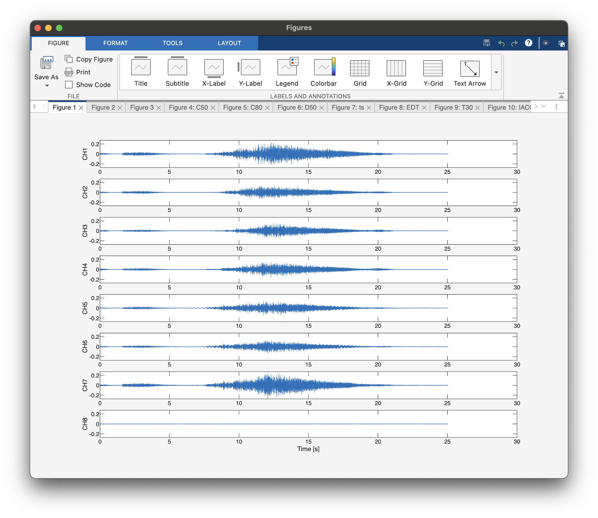
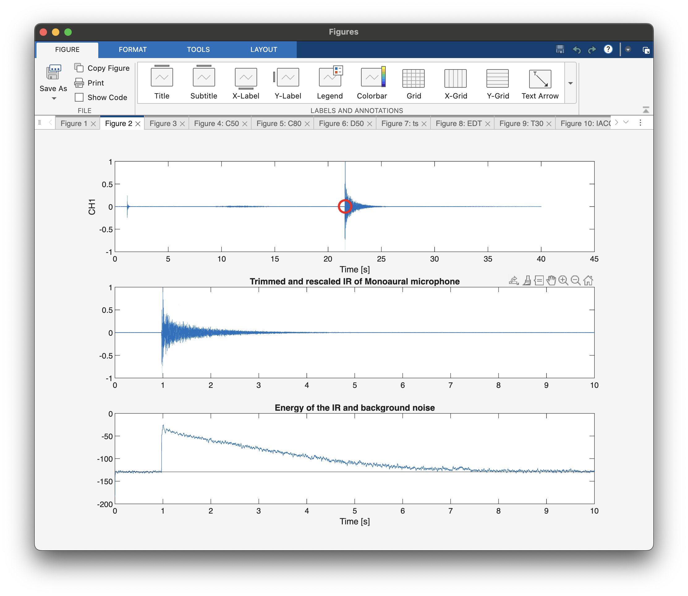
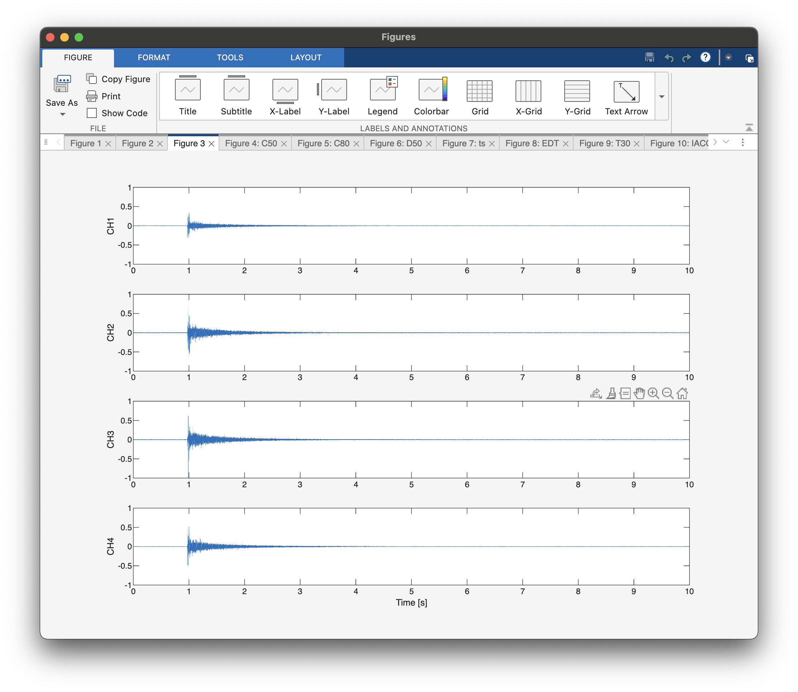
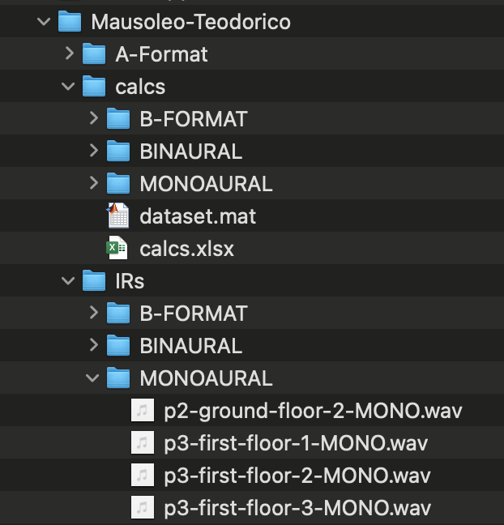
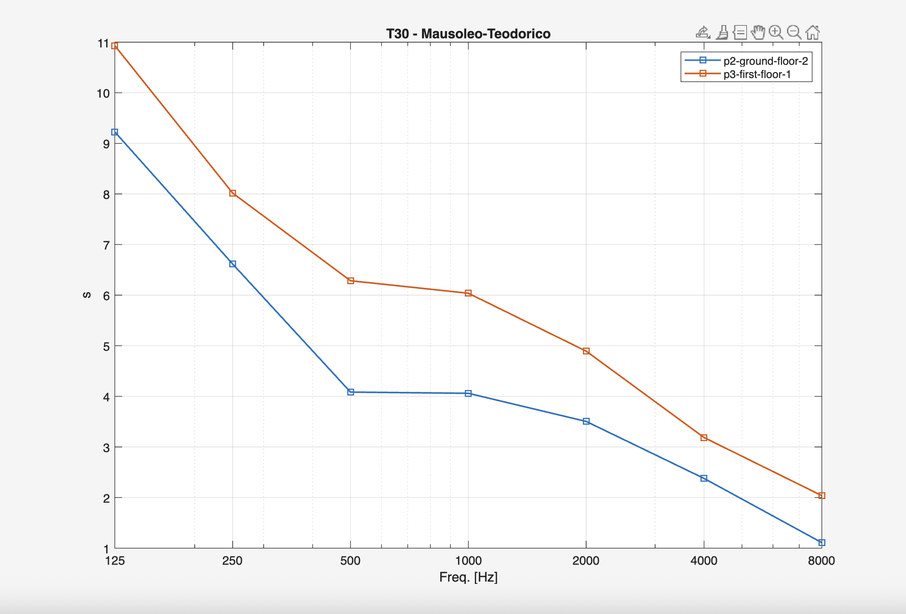

# Tajine
## Purpose

This script provides post-processing of acoustic measurements performed using the sine sweep technique.
Traditional workflows, such as using a DAW (like Adobe Audition 3.0) alongside acoustic processing plug-ins (like Aurora), are cumbersome and require many manual steps, making them highly prone to user error.

The main purpose of this script is to automate all manual steps, leaving the user with just a few visual or auditory checks to perform, thereby simplifying the procedure while retaining operator control.

## Features

-  Support and process multichannel audio files where different channels belong to different transducers (monoaural omni mic, binaural 2-channel dummy head, 3D A-Format mic)
 - Converts A-Format to B-Format ambisonics microphone signals
 - Extracts and analyse Impulse Responses based on the capturing transducer 
 - Works on both Windows and MacOS 

## Requirements
- Matlab 2025a (previous versions have not been tested)
- [Sennheiser AMBEO A-B format converter plugin](https://www.sennheiser.com/en-lt/catalog/products/microphones/ambeo-vr-mic/ambeo-vr-mic-507195#Downloads) (Au version for MacOS and VST3 version for Windows)

## Workflow

- **Input**: Multichannel audio data acquired through an audio interface from multiple microphones (transducers), inverse sweep.

- **Deconvolution**: Each transducer channel is deconvolved with the inverse of the excitation sweep to obtain the corresponding Impulse Response (IR).

- **Computation**: Each tranducers set of signals is processed by AcouPar to obtain specific acoustic parameters.

- **Output**: For each transducer, a dedicated audio file is created, containing the IRs, as well as a set of text files containing the acoustic parameters and a wrap-up spreadsheet file

### Output
- A set of **WAV files** 
  Each file includes all the processed impulse responses belonging to a single transducer (monoaural omnidirectional, binaural dummy head, Ambeo VR mic).
- A set of **text files** (.txt) containing the acoustic parameters belonging to a single transducer (processed by AcouPar)
- A wrap-up **Excel file** with containing the parameters organized in different tables, one for each transducer.
- A **dataset.mat** file containing a Matlab table with all the acoustic parameters of all the elaborated measurement points (from different input files) 

The files containing the impulse response are organised in folders by transducer type, as are the elaboration text files, the Excel file and the dataset.mat file. 

## How-to

The script can be found in [src/tajine_script.m](src/tajine_script.m) 

1. Specify a name to identify the measurement site (this is used to create the output folder): `siteName` (e.g.: *zagreb-national-thater*)
2. Specify the name of the measurement point related to the audio file in `probeId` (e.g.: *p1-gallery-bis*)
3. Specify the path of the file to to be processed: `inputFile` 
4. Specify the path of the inverse sweep file in: `invSweepFile`
5. If necessary, modify the pre-delay in: `preDly`
   and the IR trimming length in: `irTrimLen`. 
> **Note:** These values can also be changed thereafter the script has been launched and the Impulse Response length verified by the operator in the IR energy plot . The script can then be launched again to apply the new values.
6. Launch the script.

> **Note:** multiple points of the same site can be processed changing the input file and the probe ID, while keeping the same site name. The new elaboration data will be added to the output folder and to the plots.

### Manual checks
- The user shall perform a visual check of the input file data plot in Figure 1 (sweep recording)
- The user shall perform a visual check of the found impulse response and its trimmed version (Figure 2)

## CL output & Images

A typical command line output generated by Tajine can be found [here](docs/cmd_output.md).

A typical set of output figures from a Tajine run are reported below.

